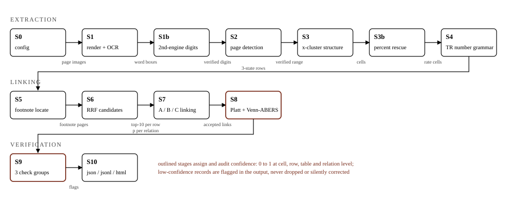
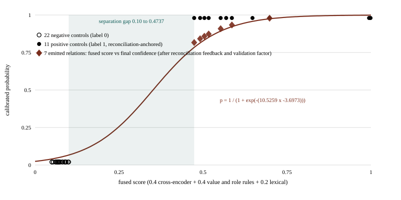
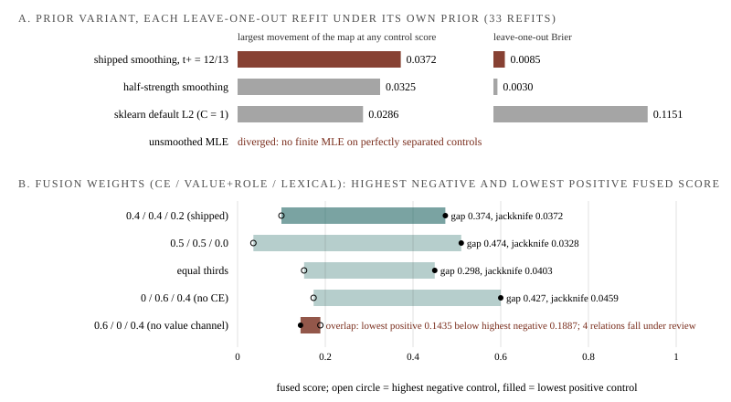

# ftlink: Staged Extraction and Footnote Linking of a Scanned Turkish Financial Statement with Run-Time Calibrated Confidence and Self-Checking Validation

Ertuğrul Demir

Inline tags such as [README 6] or [ledger] name the source of each number; the final version replaces them with the "Reproduce" appendix (Section 8).

## Abstract

We describe ftlink 1.0.2, a staged pipeline that extracts the summary financial statements from a scanned, image-only Turkish KAP audit report, locates a configured footnote, parses its tables and links summary rows to footnote rows with a confidence calibrated at run time on control samples derived from the document itself. On the reference filing (Özak GYO, 31.12.2012) the system reads 199 of 201 hand-transcribed cells exactly (Clopper-Pearson 95 percent interval 0.965 to 0.999), recovers all 7 reference links (precision and recall 1.00, one-sided 95 percent lower bound 0.652), and its validation stage reports 103 passing, 4 failing and 6 not-evaluable checks, every failure being a genuine OCR defect the pipeline caught on its own. The two wrong cells are both flagged: the contract is zero silent errors, not zero errors. Three linking approaches are compared where they diverge, the calibrator scores a leave-one-out Brier of 0.0085 against a 0.2222 base rate, two runs are byte-identical, and Every headline number in Sections 5.1, 5.5 and 5.8 is printed by a shipped command and was reproduced on a second operating system and, for the 1.0.1 zip, by an external blind evaluation (an earlier evaluation graded v0.7); the sensitivity refits of Section 5.7, the GPU study of 5.6 and the channel and reranker comparisons of 5.3 and 5.4 are development measurements and are marked as such.

## 1. Introduction

The task is a take-home specification of twelve requirements over one public filing, the 95-page audit report of Özak GYO for 31.12.2012 [README 2; coldgrade2 §1]: (1) extract the summary statements on pages 5 to 7 with title, headers, footnote references, periods, values and hierarchy; (2) parse Turkish number grammar with dash, empty and zero as three states; (3) find items referencing footnote 11, locate its pages automatically, parse its tables, link rows to rows; (4) take page range and footnote number from configuration; (5) run a pretrained NLP or ML component in linking, exact string match being insufficient; (6) reject whole-document single-call conversion; (7) emit confidences in [0, 1] at table, row, cell and relation level, neither constant nor raw model similarity, a few document-derived controls being allowed to set thresholds or weights; (8) validate with structural, format and financial groups and flag low-confidence records; (9) justify a JSON or JSONL schema; (10) compare at least two linking approaches including where they diverge and analyse at least three failure cases; (11) document setup, models, input construction, chunking, thresholds, fallbacks and results; (12) be graded on decomposition, model-plus-rules interplay, output verification, uncertainty management and re-runnability, not production completeness.

Requirement 6 is more than a rule. In the nearest shared task, NTCIR-17 UFO, free-text-to-cell linking topped out at F1 0.2325 and pure-LLM entries lost (0.1635 on linking) [97 3c]; the select formulation we ship as an optional tier degrades as the true match moves down a long list [97 3c]; and a single call over a 95-page scan leaves no intermediate product for validation to arbitrate and no path to byte-reproducible output. The pipeline is staged S0 to S10 (Section 4).

Linking has two physics on this document [E10]. Reconciliation links bind a balance-sheet carrying amount (Yatırım Amaçlı Gayrimenkuller, 373.992.222 in 2012) to opening, closing, net-book-value and total rows whose labels are dates and roles ("31 Aralık 2012 itibari ile kapanış bakiyesi"): on the 19 footnote rows every text channel fails, the dense embedder ranks the five targets at 14 to 19, and only an exact value anchor recovers them (R@5 1.00). Item-semantic links bind an income-statement item (Yatırım Amaçlı Gayrimenkul Değerleme Farkları) to a named movement row (Makul değer değişikliğinden kaynaklanan kazanç): char n-gram TF-IDF and the dense channel rank the two targets [1, 2] through the shared morpheme "değer", while word-level token-set similarity reaches about 0.40 against a 0.75 bar [E10; README 9]. The pipeline fuses both and records which approach carried each link.

Contributions, each measured on this filing:

- x-clustering over OCR word geometry, a second engine on every numeric crop and an engine swap on rate rows reach 199/201 exact cells with both misses flagged; the swap alone lifts cells from 96.5 to 99.0 percent [E28; E33].
- Three linking approaches with per-relation agreement classes; the shipped ablation shows labels-only serialization recovers 1 of 7 links at rank 5 against 7 of 7 with values, 6 discordant pairs one way, exact McNemar p = 0.031 [README 3; E45].
- A smoothed Platt map fitted at run time on 33 document-derived controls (11 positives, 22 negatives): leave-one-out Brier 0.0085 against 0.2222 base rate and 0.0579 raw fused score, jackknife worst movement 0.0372, a Venn-ABERS interval per relation; isotonic and unsmoothed logistic fits degenerate on the same controls [E45; E34].
- Three check groups plus not_evaluable catch both real OCR corruptions unaided and are mutation-tested, three injected corruptions against three named catchers [README 7; E35].
- Byte-identical output outside a quarantined run block, determinism as an exit code, identical evaluation numbers on x86_64 Ubuntu 22.04 with tesseract 4.1.1 against 5.5.3 locally, and two external blind evaluations that reproduced every printed figure [linux-drill; coldgrade2].
- Four footnotes (11, 10, 12, 13) run from configuration alone; the page-level scoping limit this exposes is measured and disclosed [ledger; E33; coldgrade2].

## 2. Related work

Linking. The DocILE line-item benchmark (2023) fixes the evaluation shape we borrow, match items first, then micro precision and recall; it is listed but not card-verified locally, so we take the shape, not the numbers [100]. The closest task with a verified card is NTCIR-17 UFO (Kimura et al., NTCIR-17 2023) over Japanese securities reports: cell-role classification reaches 0.9537 against a rule baseline of 0.7981, phrase-to-cell linking F1 0.2325 formal and 0.2970 late, the pure-LLM entries lost (0.8287 and 0.1635), and the best linker used Multilingual-E5 cosine for name cells [97 3c]. UFO inputs are clean XBRL and HTML with cell identifiers and no confidence or numeric rule, so our 1.00 on seven anchored links and their 0.2325 are not comparable; the lesson is hybrid over single-LLM. The follow-up U4 protocol is listed, not verified.

Table structure. GriTS (Smock et al. 2022) scores the most similar 2D substructures of predicted and gold grids as an F-score with topology, content and location variants and is row/column symmetric where TEDS is not [97 3c]; our cell metric is binary and position-anchored, and GriTS was not computed (Section 7). TATR v1.1-fin is trained on FinTabNet.c, the error-corrected FinTabNet of Smock et al. (arXiv:2303.00716), this document's table genre although born-digital where our pages are scans; it is planned as a config-gated upgrade behind the extract_tables() seam (no engine key exists yet) pending a GriTS comparison [97 3b; ADR-01].

Calibration at small N. Platt scaling with target smoothing, t+ = (N+ + 1)/(N+ + 2) and t- = 1/(N- + 2), is Platt 1999 Section 2.2, equations 13 and 14 [97 3b]. Niculescu-Mizil and Caruana (ICML 2005, Section 5, Figure 7) show Platt beating isotonic below "about 200-1000 cases", tested down to 32 [97 3b]; we reproduce the crossover on 33 controls (Section 5.5). Venn-ABERS predictors (Vovk and Petej, arXiv:1211.0025, UAI 2014) give [p0, p1] from two isotonic fits with the test point labelled 0 then 1; ours is the simplified construction (their Section 5, Algorithm 2), named IVAP in the 2015 follow-up (arXiv:1511.00213) [97 3b]. Beta calibration (Kull et al. 2017) reduces to logistic calibration when a = b and warns that isotonic overfits small sets; split conformal certifies coverage of a set, not a probability, with guidance near n = 1000 [97 3c]. Roelofs et al. (AISTATS 2022, arXiv 2012.08668) show equal-width-bin ECE is biased at small samples [97 3d], so we report Brier and quartile reliability, not an ECE scalar. Riley et al. (Stat Med 2021) derive that a calibration slope needs hundreds of events (worked example 9,835 participants, 177 events) and Collins et al. (Stat Med 2016) measure assessment as poor at 10 or fewer events with floors of 100 and 200 [97 3c]; our 11 positives sit in that zone, which fixes every calibration claim below to direction plus disclosed interval, never a certified slope. Threshold selection on a raw score by curve inspection (for example the 0.15 operating point chosen in İşcan, Kumaş, Patlar Akbulut and Akbulut, IEEE Access 11, 2023) answers a different question from calibration: it fixes an operating point, while a calibration stage supplies the probability that the operating point is then applied to; the two compose. ExtractConf 2026 reports document-grounded signals beating model-internal scores (OCR grounding 0.896 AUC against 0.880 for logprobs plus entropy; fusion 0.928) and recalibration on about 165 samples [97 3c], endorsing our cell composition and naming the improvement we did not build: approach disagreement as a calibrator feature.

Turkish retrieval and reranking. mMARCO (Bonifacio et al., arXiv 2108.13897) machine-translates MS MARCO into 13 languages, 14 with English; Turkish is not among them, and the shipped cross-encoder mmarco-mMiniLMv2-L12-H384-v1 rests on mMiniLMv2-L12-H384 distilled from XLM-R Large, so its Turkish behaviour is zero-shot transfer through the multilingual backbone and the binding evidence is in-document [97 3d]. TR-MTEB (Baysan and Güngör, Findings of EMNLP 2025) puts multilingual-e5-small at 56.53 nDCG@10 on retrieval against 34.82 for bert-base-turkish-uncased, backing the dense channel; it has no reranking track [97 3c]. Cetvel 2025 has no retrieval track either, finds Turkish-centric models underperform multilingual ones, avoids LLM-judge metrics as unreliable in multilingual settings, and documents the kar/kâr diacritic pairs that motivate normalization before lexical matching [97 3c]; the judge point is why validation here is deterministic arithmetic. OCRTurk (Feb 2026) crowns the PaddleOCR family on born-digital Turkish PDFs, the lineage of our second engine, but covers no scans and no CPU engines [97 3c]. RRF is Cormack et al. (SIGIR 2009); their k = 60 "was fixed during a pilot investigation" and shown not critical [97 3b].

## 3. Data and reference protocol

The document. All 95 pages are images with no text layer [README top]. Printed folios are offset from PDF pages by 4 (footnote 11 prints at 49-50, PDF pages 53 and 54). Notes pages 55 to 57 (footnote 12) are landscape scans printed sideways that the PDF /Rotate flag does not correct [README 8]. Every negative is printed in parentheses and every absence as a dash; no empty value cell occurs, so the empty state is exercised by tests, not this run [README 10]. Two cells are misread by the primary engine in well-formed ways: Stoklar 2012 (77.543.097 as 77.943.097) and Finansal Yatırımlar 2012 (4.224 as 4,224) [README 8].

The reference. One person transcribed all 201 value cells of the seven in-scope tables (182 numbers, 11 dashes, 8 empties) from the 300 dpi renders and accepted a value only after 77 arithmetic identities held; the 7 links and the footnote-reference column were built the same way [README 9; gold-audit]. A blind second re-transcription pass on 28.08.2026, seeded (20260828) and stratified 8/8/8/6, read 30 number cells from per-row crops: 30/30 exact matches; 6/6 sampled dash/empty states; a sweep over all 76 summary rows found exactly the two rows carrying reference 11 and 0 mismatches elsewhere; 53/53 identities held on the auditor's own readings plus 6/6 cross-table reconciliations; a secondary full pass agreed on 201/201 [gold-audit]. Zoomed crops confirmed the two disputed cells as OCR errors, not reference errors.

Scorer conventions [README 9]. Rows align by fuzzy label ratio and, for the two movement tables with identical row labels, split by value overlap. A reference empty cell counts as correct when no cell is emitted there. A predicted relation whose rows map to no reference row is left out of the precision count rather than counted as a false positive; on the shipped run all 7 map, and the mapped count is printed beside the precision. The cell metric has no false-positive term; the scorer prints the count of extracted rows matching no reference row, 0 here [E45].

Statistical framing [README 9]. 199/201 carries a Clopper-Pearson 95 percent interval of [0.9645, 0.9988]; 7/7 gives an exact one-sided 95 percent lower bound of 0.652 on precision and recall. Seven links show the approach functions on this filing; they cannot estimate an error rate across filings, which would need a stratified corpus, two annotators, document-level resampling and leave-one-document-out calibration scoring [101].

## 4. Method

*Figure 1. The staged pipeline. Each arrow names the artifact handed to the next stage; S8 and S9 (outlined) are where confidence is assigned and audited.*

Eleven stages; pages, footnote number, control pages, OCR settings, weights, thresholds and model revisions come from one YAML file [README 2].

1. S0 configuration. summary_pages [5, 7], footnote_no 11, extra_control_pages [9, 10], dpi 300, psm 4, rrf_k 10, anchor_weight 3.0, top_k 8, accept_threshold 0.5, rank1_min_score 0.2, lexical_threshold 0.75, two Hugging Face snapshot revisions.

2. S1 render and OCR, S1b verification. PyMuPDF renders at 300 dpi grayscale; tesseract (Turkish, psm 4) returns TSV word boxes with confidences. The settings are locked by measurement: 154/156 values verbatim at 300 dpi, 400 dpi worse, and in the full pipeline 400 dpi collapses to 79.6 percent cells and relation recall 0.14 while psm 6 corrupts the contents page and aborts the run [ledger S1; E33]. Orientation recovery re-renders at 90, 180 and 270 degrees and keeps the rotation with the most confident multi-character words; raw word count was falsified as a signal because sideways text still yields junk words. Each tesseract call has a 120 s timeout. Every numeric cell crop is re-read by a second engine (RapidOCR, ONNX): 175 of 176 crops agree, and the one disagreement is the real Stoklar corruption [ledger S1b]. Disagreement caps the cell at 0.4 and never replaces the value: flag over fix.

3. S2 page detection by check. A configured summary page yielding no coherent financial table fails STR_SUMMARY_RANGE; STR_FOOTNOTE_REFS_PRESENT fails when no summary row references the configured footnote. A footnote that cannot be located aborts with exit code 2; a wrong page range ships with failing checks, because partially wrong tables are still inspectable [README 2, 7].

4. S3 table structure, S3b rate-row rescue. Tables are borderless, so structure is geometric: money tokens are right-aligned, so value columns cluster on the right edge of numeric tokens; short dashes are assigned in a second pass by column-centre proximity; the footnote-reference column is a cluster of small integers left of the values; the label is what remains and its x-origin encodes hierarchy depth [README 2]. Text-only body lines follow a measured indent rule: a wrapped label's continuation prints about 18 px further in, a group header's followers stay at its left edge, so a cell-less line merges into the next row only when that row indents past it [E28]. Titles come from the heading block above the table (nearest note-number-prefixed line, else the topmost multi-word uppercase block that is not the company name), 7/7 real titles including the rotated "12. MADDİ DURAN VARLIKLAR", never consumed by matching [ledger S3]. On rate rows the engines swap: tesseract cannot read the percent glyph on this scan class (0/6, producing plausible 486,6 for %86,6) while RapidOCR reads all six verbatim, so RapidOCR reads and tesseract votes by exact-or-suffix digit agreement, both readings shipping in the components [E28].

5. S4 normalization. A custom Turkish grammar (parentheses, dot thousands, comma decimal, percent ranges) parses 182/182 reference tokens exactly and keeps dash, empty and zero as three states in a discriminated union on `state` [ledger S4; README 10]. A repair tier regroups a lost thousands separator (precision 1.00, recall 0.53), flags the cell `repaired` and caps it at 0.7 or 0.5. Turkish lower-casing maps İ and I correctly. Row roles come from five deterministic label rules, 11/11 on the movement rows. Leading-minus negatives are not parsed; this filing prints none [README 11].

6. S5 footnote location. Find the İÇİNDEKİLER page, parse note entries, resolve the printed-to-PDF offset from a footer folio, jump, verify the heading. Two measured OCR damages have countermeasures: mangled note numbers ("NOT 11" as "NOT1lI") are renumbered by sequence position; dot leaders eating page digits ("49-50" as "9-50") are distrusted when they break the non-decreasing page order and replaced by a bounded scan over the window implied by neighbours [README 2]. The page set is the contiguous run of pages carrying the heading: footnote 11 resolves to pages 53 and 54 by bounded scan (about 14 s), footnote 12 to 55 to 57 by direct TOC hit (about 17 s). Two page-level scoping limits are stated: a page shared by two notes goes to the note whose heading is on top and the neighbour's table enters the candidate set, and a note starting mid-page loses that page (footnote 13 starts under note 12's tables on page 57 and is located from page 58) [README 8; coldgrade2].

7. S6 candidates. Four channels fused by weighted RRF with k = 10: char_wb 2-4 TF-IDF cosine over normalized labels, rapidfuzz token-set ratio as a second word-level voter, multilingual-e5-small cosine with `query:` on both sides, and a value anchor (weight 3) on equal absolute amounts between the item's period values and a candidate row's values, period-scoped and later gated by roles [README 4]. The set per item is the RRF top 8 plus every anchor hit; reference recall 7/7. The table title is deliberately not added: it is constant across candidates and sinks the easy pair from [1, 2] to [9, 10] [E10].

8. S7 linking. A, cross-encoder mmarco-mMiniLMv2-L12-H384-v1 (118M, Apache-2.0) over `label | value ; value` on both sides with Turkish dot grouping, accepting above 0.5 or as rank-1 above a floor of 0.2, because rank ordering is the validated signal and sigmoid scales vary across rerankers [README 5]. B, value-plus-role rules: a period-scoped value match and a role-consistent row (stock values bind to opening/closing/net-book-value/total rows, flow values to movement rows); no ML. C, lexical baseline: token-set ratio over Turkish-lowercased raw labels at 0.75, the deliberately insufficient baseline. D, LLM select (off by default): one call per item to an OpenAI-compatible endpoint under a strict JSON schema, responses cached by prompt hash and replayed byte-identically; a pair accepted by D alone ships as `d_only`, keeps the fused channels' conservative confidence, always arrives flagged and never enters the control set. Every relation records per-approach scores, decisions and an agreement class (consensus, a_only, b_only, baseline_only, d_only). If the cross-encoder cannot load, A scores zero, B and C carry the run, the run block records it and every relation ships force-flagged (unit-tested).

9. S8 confidence. Cell = OCR word confidence times parse confidence, times 1.05 (capped at 1.0) on second-engine agreement, capped at 0.4 on disagreement, 0.7 or 0.5 when repaired; row = mean cell confidence with a missing-label penalty; table = mean row confidence discounted by header and period completeness; all three are ordinal compositions and declared so [README 6]. Relation = a fusion of the approach scores (0.4 A, 0.4 B, 0.2 C) through a two-parameter logistic fitted at run time on document-derived controls: positives are decisions some approach accepted whose value reconciliation passes; negatives are candidates every approach rejected; accepted-but-unreconciled decisions enter neither pool, so the hard region is never learned from the calibrator's own acceptances. The configured cash-flow pages 9 and 10, whose rows reference the footnote with sign-flipped amounts, feed only the calibrator and raise it to 11 positives and 22 negatives, fitted rather than fallback [E27]. The controls are perfectly separated, so the fit uses Platt's target smoothing (t+ = 12/13, t- = 1/24 here), which keeps it finite where an unsmoothed fit diverged and, in an earlier version, silently ran the fallback [E27; E34]. Stated plainly: approach B's acceptance and the reconciliation signature are the same arithmetic, so every B acceptance is a positive control, the separation is partly structural, and the map certifies value-anchored links; a text-only link (not-evaluable factor 0.9) needs a cross-encoder score above roughly 0.73 to clear 0.5 [README 6; coldgrade2]. Validation feedback is saturation-free: pass shrinks remaining doubt by 15 percent (1 - 0.85 (1 - p)), fail multiplies by 0.6, not-evaluable by 0.9. Below three positives or three negatives, or on a non-finite fit, fixed a = 6, b = -3 apply, `calibration_fitted` is 0.0 and every relation is flagged regardless of score. Each relation also carries a simplified Venn-ABERS interval from two isotonic fits over the controls with the test point appended as negative and as positive; because the controls are the emitted decisions themselves, the interval is computed with the relation's own label present, and the shipped script reports the leave-self-out variant (Section 5.5). The 0.5 flag is a demonstration operating point: a consumer reviews whenever p < 1 - c_review/c_miss, so review cost 1 against miss cost 20 gives 0.95, and the threshold rises with the miss cost [README 6].

10. S9 validation. Three groups plus not_evaluable: a check that cannot be evaluated never converts a missing operand into a pass or a zero [README 7]. Structural: period columns present and descending (STR_PERIOD_ORDER); references within plausible note range; located heading verified against the configured number; the calibration disclosure (STR_CALIBRATION_CONTROLS with mode, counts, separation, jackknife and Platt parameters); REL_COVERAGE, requiring every summary row referencing the configured footnote to produce at least one relation, so a silent linking loss ships as a failing check. Reference-to-row binding is verified indirectly through REL_COVERAGE plus FIN_RECONCILE. Format: repaired-cell flagging; FMT_THREE_STATE, a type-level guarantee surfaced as a check that passes by construction; sign legality (a "(-)" row must not carry a positive value); percent bounds in [0, 100]; the second-engine agreement summary. Financial: roll-forward (opening plus flows equals closing per column); category sums (Arazi plus Binalar equals Toplam); parent sums over the hierarchy; grand totals against pre-enumerated member-set hypotheses, passing when one evaluable hypothesis reproduces the total and not_evaluable when none is evaluable; an income-statement cascade with value-based deduplication; value reconciliation per accepted relation. The suite is mutation-tested by a shipped script (Section 5.8).

11. S10 output. `result.json` holds flat, ID-referenced collections (tables, rows, cells, relations, checks) with hierarchy as `parent_row_id`, deterministic semantic IDs (`p05.t00.r003.c01`), Decimal money as strings, a discriminated union on `state`, per-approach evidence and confidence components on every relation, a `document` block echoing the configured company, period and currency next to `source_sha256` of the input bytes (prefix 25e4afe4), and a quarantined `run` block with `ftlink_version` 1.0.2, the recorded `tesseract --version` and `models_loaded` [README 10]. `relations.jsonl` is a one-line-per-link view, `report.html` a self-contained visual review. Two runs are byte-identical outside the run block and `eval/determinism.py` turns that diff into an exit code.

## 5. Experiments and results

### 5.1 Headline numbers

| Quantity | Value | Source |
|---|---|---|
| Reference cells exact | 199/201 = 99.0 percent, 95 percent interval [0.9645, 0.9988] | README 9 |
| Wrong cells | 2, both real OCR corruptions, both flagged | README 8 |
| Relations | 7 predicted, 7 reference, P = R = 1.00, lower bound 0.652 | README 9 |
| Agreement classes | consensus 2, b_only 5, a_only 0, baseline_only 0 | README 9 |
| Relation confidences | 0.8164 to 0.9785, all distinct, none flagged | result.json |
| Checks | 113 instances: 103 pass, 4 fail, 6 not_evaluable | README 7 |
| Calibration | fitted, 11/22, separated, loo_max_delta_p 0.0372, platt_a 10.5259, platt_b -3.6973 | result.json |
| LOO Brier | 0.0085 (in-sample 0.0067; base 0.2222; raw fused 0.0579) | E45 |
| Tests, determinism | 37/37; byte-identical outside run block: True | ledger; E45 |
| Wall time | 27 to 32 s warm (development machine); 138 s warm, 165 s cold (x86_64 CPU); 121.7 s cold in the second external evaluation | ledger; coldgrade2 |

### 5.2 Input-construction ablation

`eval/ablation.py` ranks every reference link under both serializations [README 3; E45]. Labels-only: R@5 = 1/7, gold at ranks 9, 12, 19, 10, 1, 16, 17. With values: 7/7 at ranks 2, 4, 5, 3, 1, 2, 1. Top-1 margins with values 3.3974 (balance-sheet query) and 0.4824 (income-statement query) against 0.2106 and 0.0402. Paired: 6 discordant links (hit with values, miss without), none the other way, exact McNemar two-sided p = 0.031. Two caveats belong to the result: it is directional evidence on one document, and when two footnote rows print identical labels (the 2012 and 2011 movement tables) the best rank across the twins is credited, a tie labels-only could not break, so the convention favours labels-only.

### 5.3 Candidate channels

On the 19 footnote rows with the two referencing items as queries (five and two targets) [E10]: value anchor R@5 1.00/1.00; char_wb(2,4) TF-IDF 0.00/1.00; rapidfuzz token-set 0.60/1.00; bm25s with stemming 0.40/0.50; multilingual-e5-small 0.00/1.00 with the reconciliation targets at 14 to 19. Weighted RRF (k 5 to 10, anchor weight 3) places the balance-sheet targets at [1, 3, 4, 7, 8] and the income-statement targets at [1, 2]. Sensitivity re-runs leave the accepted set identical at top_k 8 to 2, anchor_weight 3 to 0 (confidence deltas at most 0.002), rrf_k 10 to 60 (at most 0.0001), and a same-class dense swap to paraphrase-multilingual-MiniLM-L12-v2 (at most 0.0009) [E33]. At top_k 2 the negative pool starves from 22 to 2, the map falls back, all 7 relations ship force-flagged, confidences drop by up to 0.278 and checks read 102/4/7: beam width is a calibration resource, and the system discloses the change.

### 5.4 Reranker parity

With values in the pair text the task saturates: bge-reranker-v2-m3 (568M) R@5 1.00/1.00 at 11 to 31 ms per pair on CPU, mmarco-mMiniLMv2 (118M) 1.00/1.00 at 11 ms in the first measurement and 3 ms batched or 8 ms single when re-timed, mxbai-rerank-base-v2 (0.5B) 1.00/1.00 at 54 ms [E14; ledger S7]. Labels-only, bge reached 0.20 on the balance-sheet query in a development-era measurement on a different pair set from the shipped 1/7 [100]. Rank-level parity left size, licence and ops to decide: the small model ships, the large one is a config swap, non-commercial rerankers were excluded on paper [README 3].

A configuration-only swap to a Turkish-trained 149M reranker (ytu-ce-cosmos/modernbert-tr-reranker) exposed a loader contract rather than a ranking result [E57]: the model's config lacks the sentence-transformers activation key, so the library applies a sigmoid and the linker applies a second one; scores compress to 0.51 to 0.73, 17 relations are emitted (7 true, 10 false, all flagged, calibration falls back to the unfitted mode, checks 102 / 14 / 7). With identity activation forced, the same model gives 8 relations (the 7 gold plus 1 flagged false positive), a labels-only AUC of 0.7149 against 0.4504 for the shipped model and a fused leave-one-out Brier of 0.0076 against 0.0085. The pre-registered swap rule fires, but the swap is not shippable by configuration alone in 1.0.2; the one-keyword fix and the README qualification are a versioned change left to the author's decision.

### 5.5 Calibration

`eval/calibration_loo.py` refits the smoothed Platt map with each of the 33 controls left out [E45]: LOO Brier 0.0085 against 0.0067 in-sample, 0.2222 for the base rate 11/33 and 0.0579 for the raw fused score, 0 degenerate refits. LOO reliability quartiles (n = 8/8/8/9): mean prediction 0.046, 0.053, 0.240, 0.917 against positive fractions 0.000, 0.000, 0.250, 1.000. Jackknife: the largest movement of the fitted map at any control score under leave-one-control-out refits is 0.0372 (the relation confidences additionally carry the bounded feedback, so their movement is at most that). Weight sensitivity: zeroing the lexical channel (0.5/0.5/0.0) leaves the accepted set and ordering identical and moves confidences by at most 0.0196 [ledger S8]. Family comparison on the same controls [E34]: smoothed Platt gives graded pre-feedback values 0.784 to 0.975 at the seven relations with LOO movement 0.0372; isotonic collapses to a two-plateau step with fitted values exactly {0, 1} (every accepted relation pinned at 1.0, LOO movement 0.0449); unsmoothed logistic saturates at 0.997 and above. Venn-ABERS, shipped against leave-self-out [E45]: the weakest reconciliation link rel005 moves from [0.50, 1.00] to [0.00, 1.00], the consensus fair-values total rel008 from [0.90, 1.00] to [0.889, 1.00], and the other five lower bounds from 0.667, 0.75, 0.80, 0.833, 0.875 to 0.50, 0.667, 0.75, 0.80, 0.857 (upper bounds stay 1.00). The upper bound is expected with separated controls; the informative end is p0, and the weakest link's lower bound rests on its own label, so the interval is a review-ordering device and a thinness disclosure, not a coverage guarantee. These are the calibrator's own controls: the map is coherent on this document, which says nothing about transfer.

*Figure 2. The run-time control set (22 negatives, 11 reconciliation-anchored positives) and the smoothed Platt map fitted on it (a = 10.5259, b = -3.6973). Diamonds are the seven emitted relations at their fused score and final confidence, which includes the reconciliation feedback and the validation factor; the shaded band is the score gap between the highest negative (0.10) and the lowest positive (0.4737) control.*

### 5.6 GPU calibration study (development measurement)

On an H100 with larger channel models (multilingual-e5-large, bge-reranker-v2-m3, char TF-IDF, exact anchor; fused 0.25/0.25/0.30/0.20) and leave-one-out over the earlier 38-pair, 7-positive set, an L2-regularized logistic fit scores Brier 0.145 (bootstrap 95 percent 0.080 to 0.226) against 0.235 (0.219 to 0.248) for the raw cross-encoder probability; mean Venn-ABERS width 0.174; ranking perfect [E41]. But the base-rate predictor scores 0.150 on that set and all seven positives land at 0.193 to 0.203: with 7 positives the slope is weakly identified and the default L2 penalty shrinks it further. The shipped design avoids both (smoothed targets without a penalty, 33 controls), which is why it stays graded where the study flattens. N is the bottleneck, not model capacity; 0.145 is never quoted as the shipped Brier because the sets differ.

### 5.7 Sensitivity of the run-time calibration (offline refits)

The calibrator has two free choices that the README states but does not vary: the smoothing prior on both targets, t+ = (n+ + 1)/(n+ + 2) and t- = 1/(n- + 2), and the fusion weights 0.4 / 0.4 / 0.2. Two offline experiments refit the map on the captured 33 controls under alternatives without touching the shipped code [E48/E49, evidence/calibration-sensitivity.md; corrected 29.08 after a first version refit the leave-one-out maps under the shipped prior for every variant]. Prior: with each variant refit under its own prior, leave-one-out stability is the same for every finite fit (largest movement of the map at any control score 0.0372 shipped, 0.0325 half-strength, 0.0286 sklearn default L2, C = 1). The prior decides sharpness, not stability: half-strength smoothing gives emitted confidences 0.88 to 0.99 and a lower Brier (in-sample 0.0022, LOO 0.0030 against 0.0067 and 0.0085), because the controls are perfectly separated (highest negative 0.10, lowest positive 0.4737) and any weaker prior moves toward the unsmoothed maximum-likelihood fit, which has no finite solution; the default L2 fit is under-confident (a = 2.5837, emitted relations 0.53 to 0.65, LOO Brier 0.1151). The shipped prior is kept as Platt's published, parameter-free choice: selecting the prior strength by the control Brier would tune the calibrator on the same 33 points that fit it, and on separated controls a sharper map is the over-confidence the smoothing exists to prevent. Weights: every variant that keeps the value and role channel stays separated (0.5 / 0.5 / 0.0: gap 0.474; equal thirds: 0.298; cross-encoder removed: 0.427), and removing the cross-encoder only lowers the consensus relation from 0.9785 to 0.7752; removing the value channel overlaps the classes (lowest positive 0.1435 below the highest negative 0.1887) and four relations fall under the review threshold. A text-only relation needs a cross-encoder score of 0.9311 to reach the fused threshold when lexical support is zero, 0.7311 at 0.4 and 0.5561 at 0.75. A third refit compares prior families on the same controls (E56): the Jeffreys/Firth penalised fit (a = 14.6406) and the Gelman Cauchy MAP (a = 17.6862) agree with the shipped map at every control and cross it at the gap midpoint (0.335 at fused 0.287); they differ only in steepness inside the 0.10 to 0.4737 gap, where no emitted relation falls, and give 0.886 and 0.932 at the lowest positive control against 0.784 for the shipped map, with jackknife 0.029 and 0.023 against 0.037. Their lower leave-one-out Brier (0.0019 and 0.0006 against 0.0085) is a property of separated controls, where any map closer to the step function scores better (the CORP decomposition gives DSC = UNC = 0.2222 and MCB = BS for every finite map), not evidence that a sharper map is right. Reading: the prior is a conservatism choice defended by argument, the channel the calibration leans on is the one the document itself certifies, and Section 7 returns to what this does and does not show.

*Figure 3. Offline refits on the captured controls (E48/E49), each leave-one-out refit under its own prior. Top: the largest movement of the map at any control score is 0.0372 (shipped), 0.0325 (half-strength) and 0.0286 (sklearn default L2), with leave-one-out Brier 0.0085, 0.0030 and 0.1151; the unsmoothed fit has no finite maximum-likelihood solution. Bottom: the value and role channel is what separates the classes; removing the cross-encoder keeps the separation and only lowers the consensus relation from 0.9785 to 0.7752.*

### 5.8 Validation results and mutation tests

Of 113 instances, 103 pass, 6 are not_evaluable and 4 fail [README 7; result.json]. Not evaluable: four FIN_GRAND_TOTAL on the two income-statement milestone rows (p07.t02 r024 and r028, both periods), where a fractional per-share row leaves no evaluable member hypothesis, and two STR_PERIOD_ORDER on the single-period movement tables p53.t03 and p53.t04. Failures: FMT_ENGINE_AGREEMENT at document level (the Stoklar disagreement); FIN_PARENT_SUM on p05.t00.r001 y2012 (children overshoot Dönen Varlıklar by exactly 400.000, localizing the 5-to-9 substitution); FIN_PARENT_SUM on p05.t00.r009 y2012 (the impossible fractional residue .224 from 4,224); FMT_REPAIRED_CELLS on p53.t04 (three regrouped cells, values kept, capped at 0.7). The pass count includes per-scope repeats and the type-level FMT_THREE_STATE, so the signal is in the fail and not_evaluable lines. Mutation tests [E35]: `eval/mutations.py` runs a clean reference (exactly the 4 known fails) and three corruptions injected between assembly and validation. Adding 1.000.000 to Ticari Alacaklar 2011 and its sub-rows is caught by FIN_PARENT_SUM at two hierarchy levels (r001 and r003); subtracting 500.000 from TOPLAM VARLIKLAR 2012 is caught by FIN_GRAND_TOTAL (r017); adding 7 to both periods of Yatırım Amaçlı Gayrimenkuller kills the value anchor, relations drop from 7 to 2 and REL_COVERAGE fails. Three of three named catchers fire; the clean run raises no new failure.

### 5.9 Determinism and the Linux reproduction

Two consecutive runs are byte-identical in `result.json` outside the run block, in `relations.jsonl` and in `report.html` [E45]. The submission zip was executed on a fresh x86_64 Ubuntu 22.04 machine (Python 3.13 through uv 0.12.5, tesseract 4.1.1 from apt, empty caches): `uv sync --frozen` 65 s, 37 passed in 6.84 s, first `make run` 164.8 s including both model downloads, `make eval` printing 199/201 with the same two wrong cells, P = R = 1.00 and 103/4/6, and a real double run byte-identical [linux-drill]. The development machine runs tesseract 5.5.3 [result.json]. Byte identity is scoped to the same OCR build; that the evaluation numbers survive a build change from 5.5.3 to 4.1.1 is the strongest available evidence that the pipeline is not tuned to one tesseract build.

### 5.10 Scenario-lab sensitivity

Seventeen config-diff scenarios were scored with the shipped scorer [E33]. The accepted set is invariant across accept_threshold 0.2 to 0.8 (zero relation diffs, zero confidence deltas). dpi 400 collapses to 79.6 percent cells and recall 0.14: 6 of 7 relations lost, 38 cells missing, 3 wrong values, 12 rows lost, and a new corruption of the same printed number (77.943.097 becomes 71.543.097). psm 6 breaks both locate paths and aborts cleanly. Lowering the lexical bar to 0.4 admits three baseline_only false links at 0.0442, 0.0479 and 0.0458, all flagged, precision 0.70, recall 1.00, FIN_RECONCILE failing on all three [coldgrade2 §3]. Disabling the second engine turns FMT_ENGINE_AGREEMENT not_evaluable and leaves the Stoklar corruption with only its arithmetic catcher. Removing the extra control pages keeps a fitted map at 7 positives and 10 negatives but moves confidences by up to 0.022. Disabling the percent rescue drops cells to 96.5 percent with 486,6 live in the output.

### 5.11 Generality across footnotes

Footnote 10 (page 52; a 24-cell hand-labelled reference with identities): the movement table extracts perfectly; 21/24 values (87.5 percent) after a scorer tie-break artefact is corrected (54.2 percent by the footnote-11-shaped scorer); the single true link is unreachable because the same printed 77.543.097 is corrupted differently on page 5 (77.943.097) and page 52 (71.543.097), both caught by the second engine, and every produced link ships flagged [ledger S5]. Footnote 12 (pages 55 to 57, rotated 270 degrees): 8 tables, 104 rows, 251 cells, one cross-note relation at 0.5274 under fallback calibration (1 positive, 7 negatives), flagged, checks 102/11/11; extraction is demo-grade and the roll-forward failures are reported [README 8; coldgrade2 §2]. Footnote 13: located from page 58 only; one relation (2011 net book value 14.526.075, exact anchor, reconciliation 1.0, cross-encoder 0.135 on a zero-overlap pair, b_only, 0.5871, flagged under fallback); 5 tables, 87 rows, 168 cells, checks 68/7/8; the 2012 link (14.557.878 on page 57) is absent because note 13 starts mid-page under note 12's tables, note 14's table enters the pool, and FIN_ROW_SUM correctly fails on a real misread (14.957 + 62.841 printed as 77.398) [ledger; coldgrade2 §3]. Four footnote families with zero code changes; the scoping limit is the price of page-level assignment and is disclosed.

### 5.12 External blind evaluations of the artifact

Two evaluations were run by an evaluator who saw only the submission zip and the specification, in an isolated environment. The first, on version 0.7 (23.08.2026), returned a positive overall assessment; it refuted one of its own findings on evidence, and its three confirmed findings (label OCR junk, raw-traceback exit, calibration mode typed as a float) were folded into version 0.8 with no headline change [ledger]. The second, on version 1.0.1 (29.08.2026), returned a positive overall assessment and reproduced every printed number digit for digit: 37 tests, cold run 121.7 s with 941 MB downloaded, 103/4/6, `result.json` byte-identical to the shipped file produced on another machine, 199/201 with the interval, P = R = 1.00, LOO Brier 0.0085 with the quartiles, ablation 1/7 against 7/7 with p = 0.031, all mutations caught, the footnote-12 relation 0.5274 flagged; its adversarial probes (footnote 99 exits 2; pages [20, 22] fail STR_SUMMARY_RANGE three times; threshold 0.8 unchanged; lexical 0.4 gives the three flagged false links; top_k 2 falls back) behaved as documented [coldgrade2 §2, §3]. It found four high-severity defects: a "numeric round-trip re-parse" check described in the README that did not exist in code; the mid-page footnote start losing its first page silently; adjacent-note tables leaking into the candidate pool; FMT_THREE_STATE being unfailable. It also named the structural circularity between approach B's acceptance and the calibrator's positive label, the absent reference-to-row and currency checks, cell confidence being close to the raw OCR probability, and constant 0.3/0.2 values for cell-less rows and tables [coldgrade2 §5]. Version 1.0.2 is a README-only release that removes the phantom check, declares FMT_THREE_STATE type-level, states both scoping limits, discloses the structural separation and the indirect reference binding, and documents the 1.05 boost and the 0.5 repair tier; no number changed.

### 5.13 Generality on three other filings (development measurement, no gold)

The sealed code was run unchanged on three other public audit reports with only the configuration changed (pdf path, summary pages, footnote number, control pages) [second-document-generality]. Özak GYO 31.12.2013 (born-digital, 91 pages): 6 tables, 220 cells, footnote pages 52 and 53 located from the table of contents, 4 relations, all correct by eyeball against the page images, none flagged, checks 80 pass / 8 fail / 3 not evaluable, 22 s. Özak GYO 31.12.2011 (scanned and rotated, the case document's class, 83 pages): 5 tables, 159 cells, the scan fallback located page 44 only, 1 relation, correct and flagged because a single positive control cannot fit the map, checks 67 / 2 / 4, 60 s; the note-10 movement table that begins mid-page under the heading of note 9 was not extracted and the referencing row was flagged by REL_COVERAGE. Emlak Konut GYO 31.12.2012 (born-digital, a different auditor): loud failure with exit code 2 after 62 s, because the footnote locator anchors on the heading form "NOT n" and this report prints "DİPNOT n". One silent failure mode appeared: on the 2013 render 12 of 201 numeric cells were misread, 11 of them a dropped leading digit (157.000.000 read as 57.000.000) at cell confidence about 1.0, both engines agreeing on the same crop; the financial group caught 9 of them through FIN_PARENT_SUM. Reading: the staged design and the reconciliation links transfer within the document family; two auditor conventions do not; the OCR-confidence layer cannot see a crop that excludes a digit, which is the strongest argument in this study for keeping the arithmetic checks in the confidence story rather than trusting engine agreement.

## 6. Error analysis

Six cases on this filing [README 8].

1. Silent digit substitution. Expected Stoklar 2012 = 77.543.097, produced 77.943.097; stage OCR recognition; cause 5 read as 9 with the number staying well-formed. Caught twice: the second engine disagrees and caps the cell at 0.40 (rank 4 of 193 by cell confidence), and FIN_PARENT_SUM localizes a +400.000 overshoot. The value is not replaced.
2. Separator read as decimal. Expected Finansal Yatırımlar 2012 = 4.224, produced 4,224 (four); stage OCR glyph plus grammar. Both engines read 4224, so the digit check passes by nature (cell 0.8528, rank 17 of 193) and only the financial group catches it through the impossible .224 residue. Improvement: column-type inference.
3. Percent glyph destruction. Expected %9, %10,5, %86,6, %80,8, %3, %2-%4; the primary engine yields 49, 710,5, 486,6, dropped cells and a dropped row, and "49" masqueraded as a footnote reference. Fix: the S3b engine swap (6/6) with both readings in the components and FMT_PERCENT_BOUNDS guarding the class.
4. TOC dot leaders eat page digits. Expected NOT 11 at printed 49-50, produced "9-50"; stage contents-page OCR. Caught by the monotonicity rule (9 cannot follow 48), repaired by the bounded scan to page 53, verified by re-reading the heading.
5. Wrapped label versus group header. Expected one row "Özkaynak Yöntemiyle Değerlenen Yatırımların Kar/Zararlarındaki Paylar" and the Dağılımı headers kept; produced a truncated label and lost headers; stage structure segmentation. Fix: the indent rule.
6. Rotated landscape pages (footnote 12). Expected readable tables on 55 to 57, produced near-zero words upright; stage render orientation. Fix: orientation recovery by confident-word maximum; extraction stays demo-grade and its check failures are reported.

Disclosed limits visible in the output: footnote pages are scoped by the top-of-page heading (Section 5.11); the sign check keys on the printed "(-)" marker, and one such marker is OCR-read as "(<9)" (Pazarlama, Satış ve Dağıtım Giderleri), so that row is unchecked although its values are negative anyway; the 2011 movement table's first column header carries OCR junk ("harcamalar Arazi ve Arsalar"), columns still map positionally and every value under it scores correct, but header text has no check of its own [README 7, 8; E45].

## 7. Threats to validity and limitations

One filing. Seven links bound precision and recall only at 0.652 from below and 201 cells bound accuracy at 0.9645 [README 9]; nothing here estimates an error rate across filings, and the protocol that would (30 to 50 stratified filings, two annotators, document-level bootstrap, leave-one-document-out calibration) is written but not executed [101].

N = 33, 11 positives. A calibration slope needs hundreds of events and assessment is poor at 10 or fewer [97 3c]; the claim is direction plus disclosed interval, never a certified probability, and ECE is withheld because at this N a binned estimate is a statement about the bins [97 3d].

Same renders. The reference was transcribed from the 300 dpi renders the pipeline consumes; a defect common to both would be invisible, although the identities make an undetected digit error in any total-bearing row very unlikely [gold-audit]. Hierarchy fields, labels and the 7 relations were audited only incidentally.

Twin rule. Scorer and ablation disambiguate the two movement tables with identical labels by value overlap or by crediting the best rank across twins; the second favours labels-only and is disclosed with the p-value.

In-sample Venn-ABERS. Intervals are computed with the relation's own control label present; leave-self-out widens the weakest link to [0.00, 1.00] [E45].

Structural separation. Approach B's acceptance and the reconciliation signature are one arithmetic, so the controls' separation is partly structural and the map certifies value-anchored links; confidence ordering inside the reconciliation family tracks cross-encoder and lexical noise on date-labelled rows, not semantics [coldgrade2 finding 6].

No GriTS. The cell metric is binary and position-anchored; GriTS would grade partial credit and header errors and was not computed [100].

Scope. Leading-minus negatives are not parsed; roles rest on the five Turkish phrases this filing uses; cross-statement identities (assets equal liabilities plus equity, the net-profit tie, prior closing equals current opening) are not shipped; footnote scoping is page-level; currency is echoed from config, not verified against the printed header [README 11; coldgrade2].

What would change the design. A material GriTS gain for TATR v1.1-fin over x-clustering on pages 53 and 54 makes TATR a configurable primary behind the existing extraction interface [ADR-01]; the local pre-check (E50) already shows that this test presupposes a detection fix, since the detector misses page 54 at both thresholds. Hard-negative margins favouring the 568M reranker, or an NLI channel with an independence argument, move fusion from fixed weights toward a noisy-OR variant [ADR-02; ADR-03]. Sub-page footnote segmentation removes both scoping limits; approach disagreement as a calibrator feature and type-conditional thresholds are the named next step [97 3c]; cell-level isotonic calibration becomes viable only above about 200 certified cells [matrix].

## 8. Reproducibility appendix

Prerequisites: Python 3.11 or newer, uv, tesseract with Turkish data (`brew install tesseract tesseract-lang` or `apt install tesseract-ocr tesseract-ocr-tur`), the source PDF at `data/ozak_gyo_2012.pdf`. Commands and the lines they print on the reference filing [README 1; coldgrade2 §2]:

| Command | Expected printed lines |
|---|---|
| `uv sync --frozen` (or `make setup`) | clean resolve from `uv.lock` |
| `uv run pytest -q` (`make test`) | `37 passed` |
| `uv run ftlink run --config configs/default.yaml` (`make run`) | `tables=7 rows=95 cells=193 relations=7 (low_conf=0)`, `checks 103 pass / 4 fail / 6 not_evaluable`, `done in N s`; first run downloads about 950 MB of weights |
| `uv run python eval/score.py` (`make eval`) | `CELLS: total=201 correct=199 (99.0%) wrong_val=2 wrong_state=0`, `CI [0.9645, 0.9988]`, `RELATIONS: gold=7 predicted=7 tp=7 fp=0 fn=0 P=1.00 R=1.00`, lower bounds `0.652 / 0.652`, unmatched extracted rows `0`, `CHECKS: 103 pass / 4 fail / 6 not_evaluable` |
| `uv run python eval/determinism.py` (`make determinism`) | `DETERMINISM: byte-identical outside the run block: True`, exit 0 |
| `uv run python eval/calibration_loo.py` (`make calibration`) | `n=33 pos=11 neg=22 fitted platt_a=10.5259 platt_b=-3.6973 separated=true`; Brier `base 0.2222, raw fused 0.0579, in-sample 0.0067, LOO 0.0085`; LOO quartiles `0.046/0.053/0.240/0.917` with positive fractions `0.000/0.000/0.250/1.000`; Venn-ABERS rel005 `(0.5, 1.0)` to leave-self-out `(0.0, 1.0)`, rel008 `(0.9, 1.0)` to `(0.8889, 1.0)` |
| `uv run python eval/ablation.py` | `labels-only R@5 = 1/7` (ranks 9, 12, 19, 10, 1, 16, 17); `labels+values R@5 = 7/7` (ranks 2, 4, 5, 3, 1, 2, 1); `PAIRED: values-only hits 6, labels-only hits 0, exact McNemar p = 0.031` |
| `uv run python eval/mutations.py` | `member_digit caught by FIN_PARENT_SUM at r001 and r003`; `grand_total caught by FIN_GRAND_TOTAL at r017`; `link_row_values caught by REL_COVERAGE (relations 7 to 2)`; `MUTATIONS: all caught` |
| `uv run ftlink run --config configs/alt_footnote.yaml` (`make run-alt`) | `tables=8 rows=104 cells=251 relations=1 (low_conf=1)`, `checks 102/11/11`; the relation at 0.5274 flagged, `mode=fallback positives=1 negatives=7` |

Pins. Package versions are pinned by `uv.lock` (89 packages; torch on the CPU index on Linux). Model weights are pinned to Hugging Face snapshot revisions in `configs/default.yaml`: `intfloat/multilingual-e5-small` at 614241f622f53c4eeff9890bdc4f31cfecc418b3 and `cross-encoder/mmarco-mMiniLMv2-L12-H384-v1` at 1427fd652930e4ba29e8149678df786c240d8825, passed to every loader; `HF_HUB_OFFLINE=1` after the first run gives an assertable offline property. The OCR engine is a system dependency, so byte identity is scoped to the same tesseract build; the `run` block records `tesseract --version` (5.5.3 on the development machine, 4.1.1 in the Linux reproduction), `ftlink_version` 1.0.2, `models_loaded` and a config echo. `document.source_sha256` fingerprints the input (prefix 25e4afe4). Inference is CPU, fp32, no sampling; the optional LLM tier replays a prompt-hash cache byte-identically.

## 9. References

Only papers with a verified claim card in the local library are listed; where the card gives no arXiv identifier, DOI or venue, the entry says so.

1. Platt, J. (1999). Probabilistic outputs for support vector machines. Section 2.2, equations 13 and 14. (no identifier in the local library)
2. Vovk, V., Petej, I. (2014). Venn-Abers predictors. arXiv:1211.0025, UAI 2014; simplified construction Section 5, Algorithm 2. IVAP naming: 2015 follow-up, arXiv:1511.00213.
3. Niculescu-Mizil, A., Caruana, R. (2005). Predicting good probabilities with supervised learning. ICML 2005, Section 5, pp. 6-7, Figure 7.
4. Cormack, G. V., Clarke, C. L. A., Buettcher, S. (2009). Reciprocal rank fusion. SIGIR 2009, Section 1, Table 1.
5. Smock, B., et al. Aligning benchmark datasets for table structure recognition (FinTabNet.c). arXiv:2303.00716. PubTables-1M: CVPR 2022, pp. 4634-4642.
6. Smock, B., et al. (2022). GriTS: grid table similarity. Local PDF smock2022-grits.pdf, Equation 6 p. 7. (no identifier in the local library)
7. Select versus match formulations for LLM entity matching. COLING 2025, local PDF select-vs-match-coling2025.pdf, pp. 2, 6-8. (no identifier in the local library)
8. Cetvel: a Turkish LLM benchmark (2025). Local PDF cetvel2025.pdf, pp. 1, 3-6. (no identifier in the local library)
9. ExtractConf (2026). Document-grounded confidence for extraction. Local PDF extractconf2026.pdf, Table 1 p. 7, pp. 6-9. (no identifier in the local library)
10. OCRTurk (2026). Turkish document-parsing benchmark. Local PDF ocrturk2026.pdf, pp. 6-7, 10-11. (no identifier in the local library)
11. Kull, M., et al. (2017). Beta calibration. Local PDF beta-calibration2017.pdf, Proposition 1 p. 5. (no identifier in the local library)
12. Introduction to conformal prediction (2021). Local PDF conformal-intro2021.pdf, Theorem 1 p. 6, p. 14, Table 1 p. 15. (no identifier in the local library)
13. Docling technical report (2024). Local PDF docling2024-techreport.pdf, pp. 3-4. (no identifier in the local library)
14. İşcan, C., Kumaş, O., Patlar Akbulut, F., Akbulut, A. (2023). Wallet-Based Transaction Fraud Prevention Through LightGBM With the Focus on Minimizing False Alarms. IEEE Access 11, pp. 131465-131474. DOI 10.1109/ACCESS.2023.3321666 (operating point 0.15 chosen by curve inspection, Table 1 p. 6).
15. Baysan, M. S., Güngör, T. (2025). TR-MTEB: a Turkish embedding benchmark. Findings of EMNLP 2025, Table 2 p. 8, Table 9 p. 19.
16. Kimura, Y., et al. (2023). Overview of the NTCIR-17 UFO task. NTCIR-17, Tables 5-7 pp. 5-6, Table 14 p. 8.
17. Riley, R. D., et al. (2021). Minimum sample size for external validation of a clinical prediction model. Statistics in Medicine, pp. 1, 6, 11, 16, Table 1 p. 18.
18. Collins, G. S., et al. (2016). Sample size considerations for the external validation of a multivariable prognostic model. Statistics in Medicine, pp. 1, 2, 7-9, 11.
19. Roelofs, R., Cain, N., Shlens, J., Mozer, M. C. (2022). Mitigating bias in calibration error estimation. AISTATS 2022, arXiv 2012.08668.
20. Bonifacio, L., et al. mMARCO: a multilingual version of the MS MARCO passage ranking dataset. arXiv 2108.13897. Model card: cross-encoder/mmarco-mMiniLMv2-L12-H384-v1 (base nreimers/mMiniLMv2-L12-H384-distilled-from-XLMR-Large).

Mentioned without a verified card: the DocILE line-item benchmark (2023) and the NTCIR-18 U4 protocol, listed in the reading list only; no identifier is given for them here.
